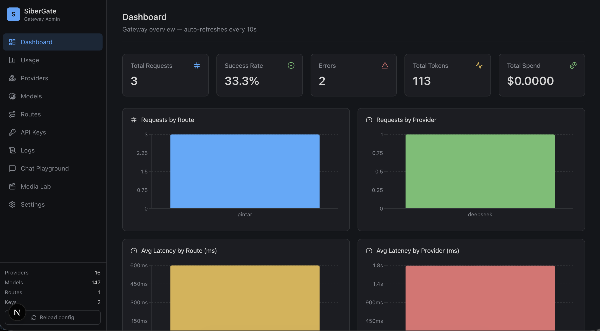
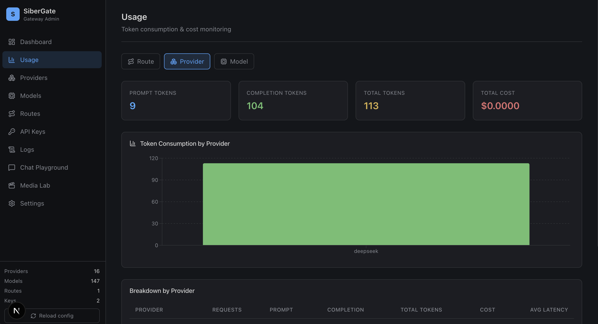
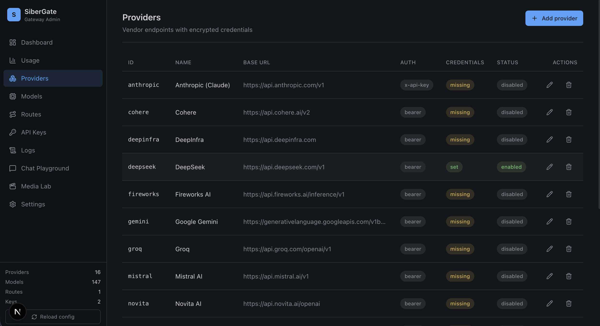
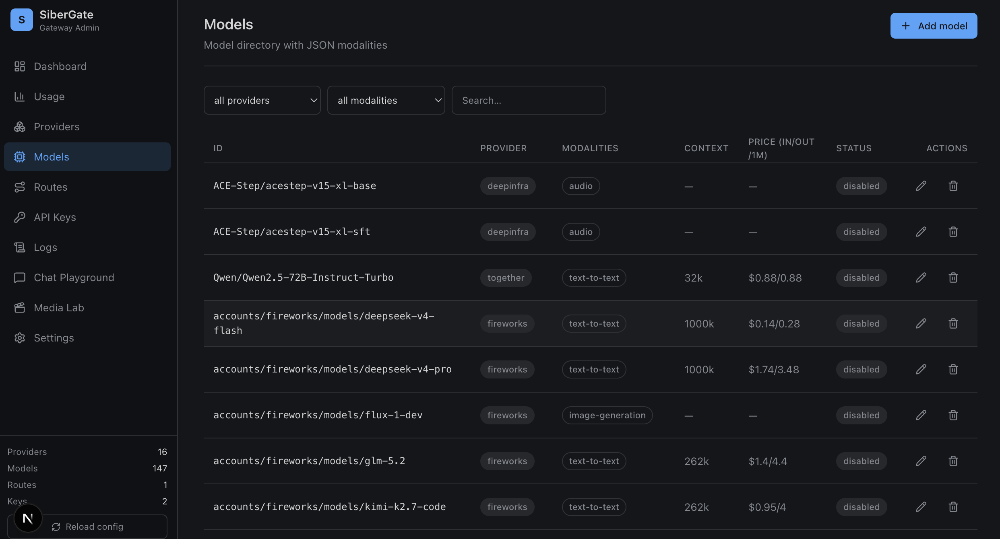
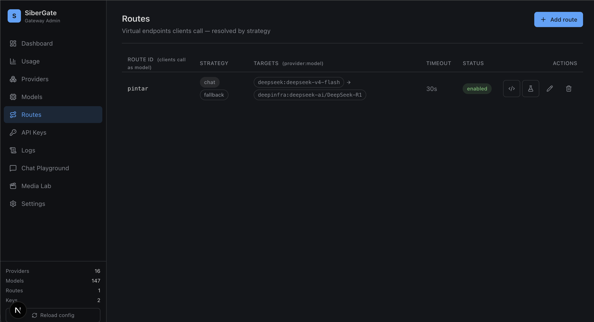
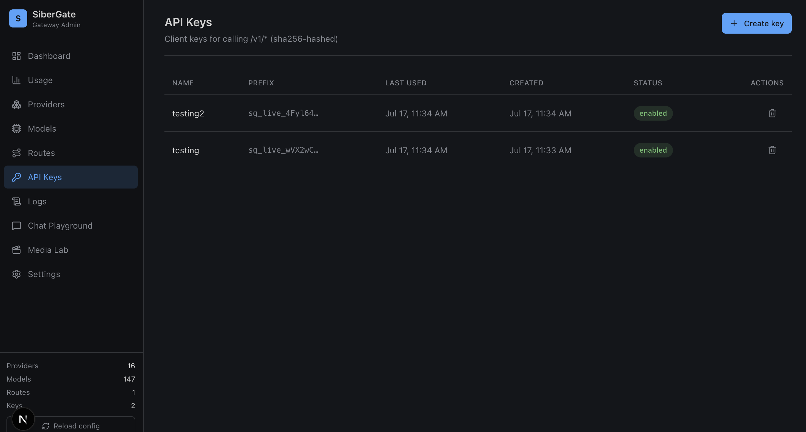
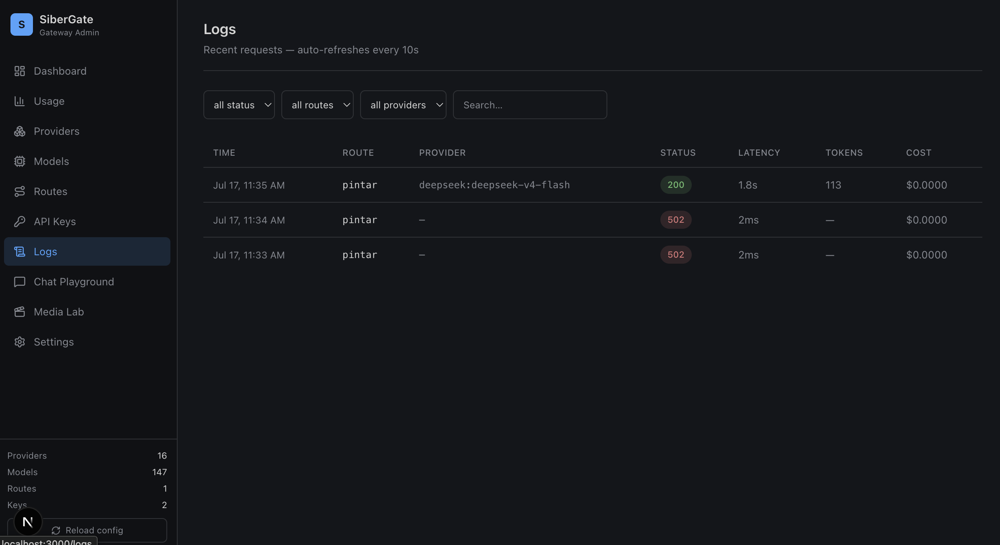
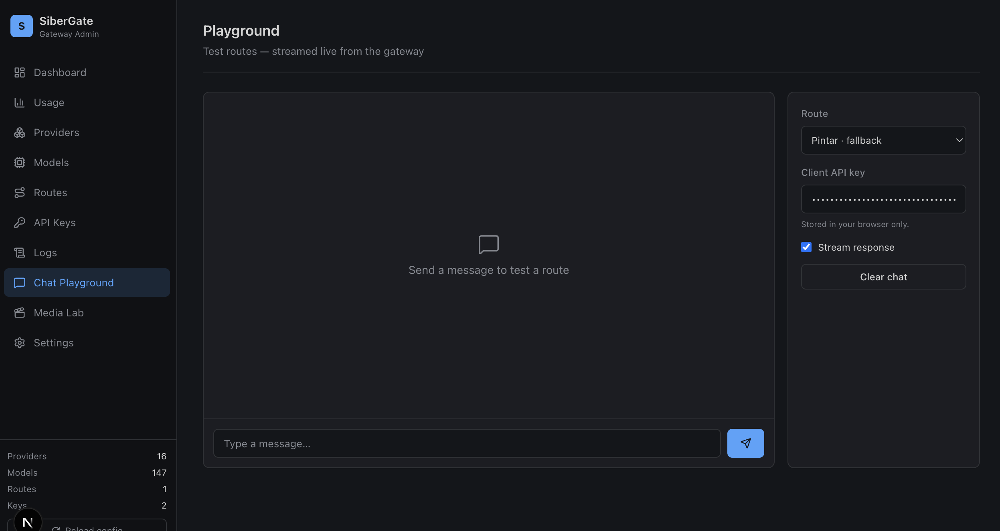
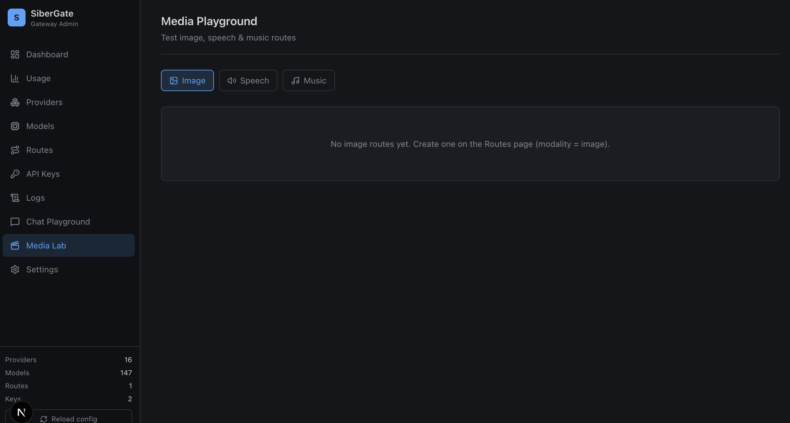
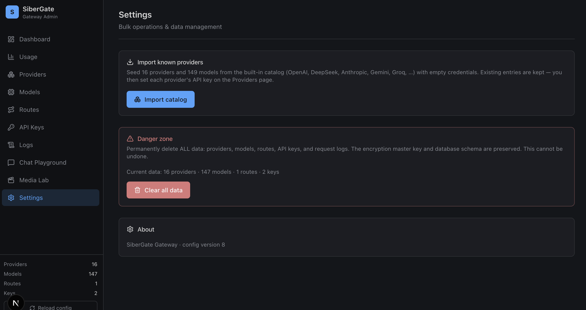

<div align="center">

# 🚪 SiberGate

**The self-hosted AI gateway that routes intelligently across every provider.**

One OpenAI-compatible endpoint. Six modalities. Smart fallback, fastest-pick,
and load balancing — all on your own infrastructure, with zero markup.

[](./LICENSE)
[](https://nodejs.org)
[](#-built-in-catalog)
[](#-built-in-catalog)
[](#-contributing)

</div>

---

> 📖 **[Baca dalam Bahasa Indonesia](./README.md)** · 🌐 **Part of the [Siber Ecosystem](https://datasiber.com)** — built & maintained by **DataSiberLab**.

SiberGate is a privacy-first, open-source **reverse proxy** that sits in front of
your LLM, image, audio, and embedding providers. Instead of hard-coding one
vendor into every app, you point your clients at SiberGate and let it handle the
hard parts: routing, failover, load balancing, cost tracking, and credential
management — all through a clean admin dashboard.

```bash
# Point any OpenAI SDK client at SiberGate — that's it.
const client = new OpenAI({ baseURL: "http://localhost:8787/v1", apiKey: "sg_live_..." });
await client.chat.completions.create({ model: "smart", messages: [...] });
```

<p align="center">
  
</p>

---

## ✨ Why SiberGate?

| | OpenRouter / SaaS gateways | **SiberGate** |
|---|---|---|
| 🏠 **Where it runs** | Their cloud | **Your machine** |
| 🔑 **API keys** | They hold them | **You hold them** (AES-256-GCM encrypted) |
| 💰 **Cost** | + markup per token | **0 markup** — you pay providers directly |
| 🔒 **Privacy** | Data flows through them | **Data never leaves your infra** |
| 🎛️ **Control** | Their UI, their limits | **Full control** — self-host, your rules |
| 🚀 **Setup** | Signup + credits | `npm run seed && npm start` |

### 🎯 Key features

- **🔌 One endpoint, all providers** — OpenAI, DeepSeek, Anthropic, Gemini, Groq, Mistral, and 10+ more, unified behind the OpenAI API you already use.
- **🧠 Smart routing** — `fallback` (auto-failover), `fastest` (lowest-latency pick), `weighted` (load balancing). Strategies apply to every modality.
- **🎨 Six modalities** — chat, image generation, text-to-speech, transcription, embeddings, and **text-to-music** (DeepInfra ACE-Step).
- **🛡️ Seamless failover** — a provider goes down? SiberGate silently moves to the next. Your client never notices.
- **🔐 Centralized key vault** — clients only ever see a `sg_live_*` key. Real provider keys are encrypted at rest, decrypted transiently at request time, and never logged.
- **📊 Built-in observability** — per-request logs, token & cost tracking by route/provider/model, live dashboard with charts.
- **🖥️ Admin dashboard** — full CRUD for providers, models, routes, and keys; a chat & media playground; Postman-style code snippets in 6 languages.
- **💾 SQLite, zero ops** — one file, no database server to run. Master data, logs, and credentials all in one portable DB.
- **🔮 Future-proof** — JSON modalities mean adding new capabilities (video, code execution) is a data change, not a refactor.

---

## 🚀 Quickstart

### Prerequisites
- [Node.js](https://nodejs.org) ≥ 20 (or [Bun](https://bun.sh))
- That's it. SQLite is bundled; no Postgres/Redis needed.

### 1. Install
```bash
git clone <repo-url> sibergate && cd sibergate
npm install
```

### 2. Configure
```bash
cp .env.example .env
# Add at least one provider key, e.g. OPENAI_API_KEY=sk-...
# Optionally set SIBERGATE_ADMIN_KEY to pin the admin token
```

### 3. Seed & run
```bash
npm run seed     # encrypts keys into SQLite, prints a client API key
npm run dev      # gateway :8787 + admin dashboard :3000
```

### 4. Try it
```bash
# Chat via the gateway
curl http://localhost:8787/v1/chat/completions \
  -H "Authorization: Bearer sg_live_xxx" \
  -H "Content-Type: application/json" \
  -d '{"model":"smart","messages":[{"role":"user","content":"Hello!"}]}'

# Generate an image
curl http://localhost:8787/v1/images/generations \
  -H "Authorization: Bearer sg_live_xxx" \
  -H "Content-Type: application/json" \
  -d '{"model":"image-fast","prompt":"a cat in a spacesuit"}'
```

Or open **http://localhost:3000** for the admin dashboard.

---

## 🏗️ Architecture — two pillars

### 1. Master Data (SQLite — single source of truth)
- **Providers** — vendor endpoints + per-modality URL templates + **AES-256-GCM encrypted credentials**
- **Models** — specs with **JSON modalities** (`text-to-text`, `vision`, `image-generation`, `audio`, `embeddings`, …) so adding new capability types is a data change, not a code change
- **API keys** — client keys (sha256-hashed; plaintext shown once at creation)

### 2. Routing Engine (operational)
- **Routes** — virtual client-facing endpoints (`smart`, `chat`, `image-fast`, …) tagged with a modality
- **Route targets** — ordered `(provider, model, weight)` mappings; filtered to providers that actually support the route's modality
- **Strategies** — `fallback`, `fastest` (EMA latency), `weighted`
- **Requests** — per-request log (latency, tokens, cost, errors, served-by)

The polymorphic **provider adapter** dispatches each request to the right
modality handler (chat / image / speech / transcribe / embed / music), so one
gateway serves them all.

---

## 📦 Built-in catalog

SiberGate ships with a curated catalog of **18 providers** and **206 models** —
importable with one click (empty credentials; you set the keys afterward).
Coverage spans 6 modalities: text, vision, image-generation, audio (TTS/music),
audio-transcription, and embeddings.

| Provider | Modalities | Highlights |
|---|---|---|
| **OpenAI** | chat · vision · image · speech · transcribe · embed | GPT-5.6 (Sol/Terra/Luna), GPT-5.5, GPT-5.4 family, GPT-5, GPT-4.1, o3/o4, GPT Image 2, DALL·E, Realtime, TTS, Whisper, embeddings |
| **Anthropic** | chat · vision | Claude Fable 5, Opus 4.8 / 4.7 / 4.6 / 4.5, Sonnet 5 / 4.6 / 4.5, Haiku 4.5, 3.7 / 3.5 line |
| **Google Gemini** | chat · vision · audio · image · embed | Gemini 3.5 Flash, 3.1 Pro / Flash-Lite, 3 Flash, 2.5 Pro / Flash, Nano Banana 2 / Pro, Lyria 3 (music), Flash TTS, embeddings |
| **DeepSeek** | chat | DeepSeek V4 Flash / Pro, V3, R1 |
| **Groq** | chat · transcribe | GPT OSS 120B / 20B, Llama 4 Scout, 3.3 70B, Qwen3, DeepSeek R1 distill, Whisper v3 / Turbo |
| **xAI (Grok)** | chat · vision · image | Grok 4.5 / 4.3 / 4.20 Reasoning, Grok Build, Grok Imagine (image + video) |
| **Mistral** | chat · vision · embed · audio | Mistral Large 3 / Medium 3.5 / Small 4, Pixtral Large / 12B, OCR 4, Voxtral TTS, Embed |
| **OpenRouter** | chat · vision | Auto (cheapest), plus cross-vendor GPT-5.x / Claude / Gemini routing |
| **Together AI** | chat · vision · image | DeepSeek V4 Pro / Flash, Llama 4 / 3.3, Qwen 2.5 72B, FLUX.1 schnell / dev |
| **Fireworks AI** | chat · vision · image · transcribe | DeepSeek V4, GPT OSS 120B, Llama 4 Scout, Kimi K2.7, GLM 5.2, FLUX.1 dev, Whisper v3 |
| **Cohere** | chat · embed | Command A+ / A, R+ / R, Embed v3 (English + Multilingual) |
| **Perplexity** | chat | Sonar Pro, Sonar, Sonar Reasoning Pro |
| **Novita AI** | chat · image · embed | DeepSeek / Llama / Qwen via Novita + FLUX.1 / SDXL / SD 3.5 images |
| **DeepInfra** | chat · vision · image · music | ACE-Step text-to-music, FLUX.1, SD 3.5, Llama 4, DeepSeek R1 |
| **Z.AI (GLM)** | chat · vision · image · video · transcribe | GLM-5.2 / 5.1 / 5, GLM-4.7 / 4.6, GLM-V (vision), GLM-OCR, CogView-4, CogVideoX, Vidu (video), GLM-ASR |
| **Qwen Cloud** | chat · vision · audio · image · video · embed · transcribe | Qwen3.7-Max, Qwen3.6/3.5 series, Qwen-VL, Qwen-Omni (speech), Qwen Image 2.0, Wan 2.6 (video), CosyVoice TTS, embeddings |
| **Ollama** (local) | chat · vision · embed | Llama 3.3, Qwen 2.5, LLaVA, Nomic Embed |
| **vLLM** (local) | chat | Any HuggingFace model you serve |

_Settings → "Import catalog" → fill keys → done. Local providers (Ollama, vLLM)
need no key — just enable them._

---

## 🖥️ Admin Dashboard

A dark-themed dashboard (Next.js + shadcn/ui) at `http://localhost:3000`:

<p align="center">
  
</p>

### Screenshots

<details>
<summary><b>📸 View all screens</b></summary>

| Screen | Preview |
|---|---|
| **Dashboard** — live stats, charts by route/provider/model |  |
| **Usage** — token & cost monitoring, provider×model matrix |  |
| **Providers** — CRUD with encrypted credentials |  |
| **Models** — directory with modality badges & filters |  |
| **Routes** — virtual endpoints, modality + target builder |  |
| **API Keys** — issue & manage client keys |  |
| **Logs** — filterable request table + detail drawer |  |
| **Chat Playground** — live SSE streaming test |  |
| **Media Lab** — image, speech & music generation |  |
| **Settings** — import catalog & danger zone |  |

</details>

### Features

- **Dashboard** — live stats (requests, success rate, tokens, spend) + charts by route/provider/model
- **Usage** — token & cost monitoring across providers, models, and routes; provider×model matrix
- **Providers / Models / Routes / API Keys** — full CRUD with inline forms; route form filters models by selected modality
- **Logs** — filterable request table + detail drawer
- **Chat Playground** — test routes with live SSE streaming
- **Media Lab** — generate & preview images, speech, and music inline
- **Route testing** — probe any route and visualize the failover path
- **Code snippets** — Postman-style client code in cURL / Node / Python / PHP / Go

The admin key is injected server-side via a proxy route — it never reaches the
browser. The playground uses a separate client key (`sg_live_*`).

---

## 🔌 API reference

| Method | Path | Description |
|---|---|---|
| `GET` | `/health` | Liveness |
| `GET` | `/v1/models` | List enabled routes (tagged with modality) |
| `POST` | `/v1/chat/completions` | Chat (streaming + JSON) |
| `POST` | `/v1/images/generations` | Image generation |
| `POST` | `/v1/audio/speech` | Text-to-speech (binary) |
| `POST` | `/v1/audio/transcriptions` | Speech-to-text |
| `POST` | `/v1/embeddings` | Text embeddings |
| `POST` | `/v1/music/generations` | Text-to-music (SiberGate extension) |

`model` is always a **route id** (e.g. `smart`), not a vendor model id. Errors
follow the OpenAI envelope: `{ "error": { message, type, param, code } }`.

---

## 🧱 Tech stack

| Layer | Choice |
|---|---|
| Runtime | **Node 20+** / Bun, **tsx** for dev |
| HTTP | **Hono** (fast, type-safe, great streaming) |
| Database | **SQLite** (`better-sqlite3`) — one file, no server |
| Crypto | **AES-256-GCM** (auto-generated master key) |
| Admin UI | **Next.js 15 + shadcn/ui + Tailwind** |
| Charts | **Recharts** |
| Data fetching | **TanStack Query** |

### Monorepo layout (npm workspaces)
```
sibergate/
├── packages/
│   ├── core/        @sibergate/core    → db, crypto, config, engine, adapters, admin
│   ├── gateway/     @sibergate/gateway → Hono server + OpenAI-compat routes
│   └── admin/       @sibergate/admin   → Next.js dashboard
├── scripts/seed.ts                     → seed runner
├── sibergate.config.json               → master-data seed file
└── .env                                → provider keys (gitignored)
```

---

## 🔐 Security

- Provider credentials are **AES-256-GCM encrypted** at rest. Master key auto-generates at `.sibergate/master-key` (gitignored); pin it via `SIBERGATE_MASTER_KEY` for multi-host deploys.
- Client API keys are **sha256-hashed**; plaintext shown once at creation.
- The admin key lives server-side only — the browser hits a proxy route that injects it.
- Decryption is transient (in-memory at request time); keys are never logged.

---

## 🗺️ Roadmap

- [x] Core gateway (chat) + routing engine (fallback/fastest/weighted)
- [x] Multi-modality (image, speech, transcribe, embed, music)
- [x] Admin dashboard (CRUD, logs, usage, playground, media lab)
- [x] Built-in provider catalog (18 providers, 206 models)
- [ ] Response caching (exact-match)
- [ ] Budget guards (monthly spend caps per key)
- [ ] Video generation (Runway/Pika)
- [ ] OpenTelemetry metrics export
- [ ] Helm chart for Kubernetes

---

## 🤝 Contributing

Contributions are welcome! This is part of the **Siber ecosystem** and we'd love
to grow it with the community.

1. Fork & clone the repo
2. `npm install && npm run dev`
3. Make your change (please keep the two-pillar architecture intact)
4. Open a PR describing what & why

For major changes, please open an issue first to discuss the direction.

---

## 📄 License

Released under the **MIT License**. See [LICENSE](./LICENSE).

You're free to use, modify, and distribute SiberGate — including commercially.
Attribution to **DataSiberLab** and the Siber ecosystem is appreciated but not
required.

---

## 📬 Contact & Community

<div align="center">

**Built with ❤️ by [DataSiberLab](https://datasiber.com)** as part of the Siber ecosystem.

📧 **Contact:** [candrapwr@datasiber.com](mailto:candrapwr@datasiber.com)
🌐 **Website:** [datasiber.com](https://datasiber.com)

Found SiberGate useful? ⭐ Star the repo and share it with fellow builders!

</div>
